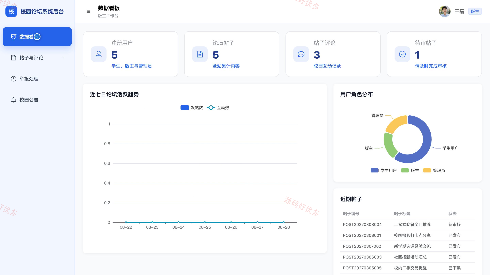
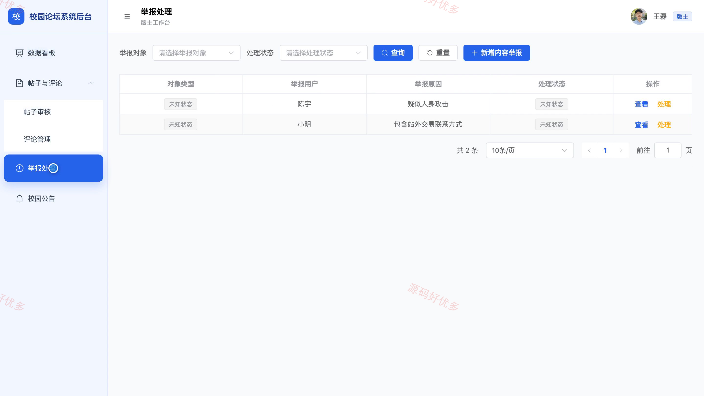
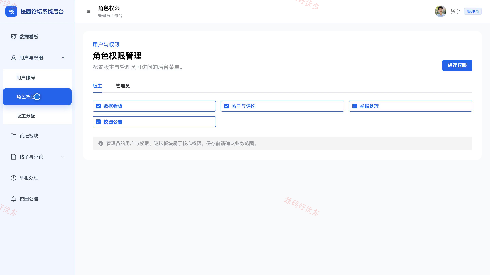

# bs092A
bs092A校园论坛系统
## 源码问题查看主页咨询

### 一、关键词
校园论坛、校内社区、校园交流、学生社区、校园话题

### 二、作品包含
源码+数据库+万字设计文档+PPT+全套环境和工具资源+本地部署教程

### 三、项目技术
前端技术： Html、Css、Js、Vue3.4、Element-Plus
后端技术：Java、SpringBoot3.2.0、MyBatis-Plus

### 四、运行环境（以下版本亲测，其他版本兼容性请自行测试）
开发工具：IDEA/eclipse + VSCODE

数据库：MySQL5.7+（共15张表）

数据库管理工具：Navicat10以上版本

环境配置软件： JDK17 + Maven3.6.3

前端Nodejs：20.19.5

浏览器：谷歌浏览器

### 五、项目介绍
项目编号：bs092A

校园论坛系统面向学生用户、版主和管理员，围绕校园公告、论坛板块、帖子发布与审核、评论互动、点赞收藏、内容举报和消息通知形成完整的校园交流与内容治理流程，并支持版主分区巡查以及管理员统一维护用户、权限和论坛板块。

角色：学生用户、版主、管理员

学生用户功能：校园账号注册与登录、校园公告与论坛板块浏览、帖子搜索筛选与详情查看、帖子发布与状态跟踪、帖子点赞收藏与评论互动、违规内容举报、个人帖子收藏及消息查看、个人资料与登录密码维护。

版主功能：负责板块内容巡查、帖子审核与驳回理由登记、违规帖子与评论处理、用户举报核查与结果登记、帖子置顶与精华管理、校园公告发布与维护、发帖互动与举报统计、个人资料维护。

管理员功能：平台运营数据统计、学生用户账号与状态管理、管理员与版主权限配置、版主分配与负责板块设置、论坛板块管理、全站帖子与评论管理、举报记录处理、校园公告管理。

### 六、运行截图

